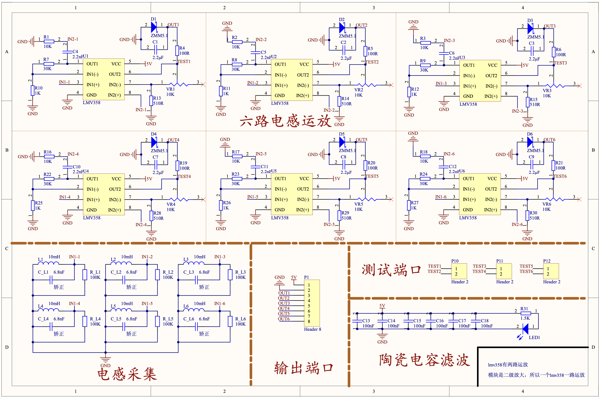
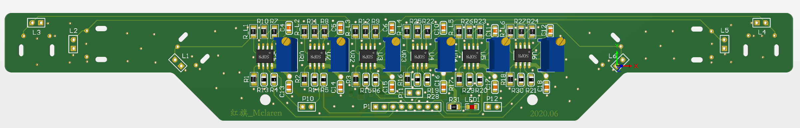

# Inductance-Detection-Module

## INTRODUCTION
​This is a circuit diagram for an LMV358 four-channel operational amplifier electromagnetic module. The circuit consists of four 10mH inductors and 6.8nF capacitors to form a resonant circuit. The AC electromagnetic signal with a frequency of 20kHz is collected and transmitted to the LMV358 for two-stage amplification and rectification, then output to the microcontroller interface. A potentiometer can be used to adjust the received signal strength.

## SCHEMATIC

## PCB

